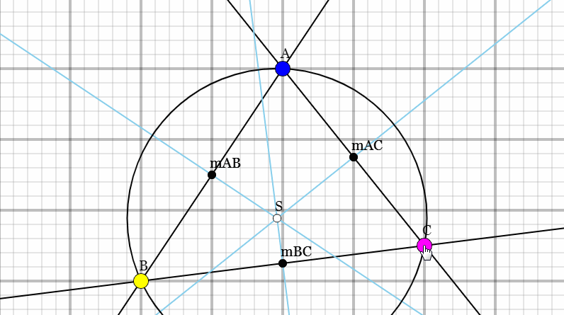

# Circumcenter

## opdracht
Vind bij een willekeurige driehoek het **circumcenter** en geef de circumcicle (omgeschreven cirkel) weer

## Doe dit in de volgende stappen:
1. Teken willekeurige driehoek ABC (gebruik eventueel DragablePoint)
2. Bepaal de vectoren AB, BC en CA
3. Bepaal de vectoren van het midden van deze zijden mAB, mBC en mCA.
4. Bepaal de normaalvectoren van AB, BC en CA
5. Maak twee Rays met
   1. steunvector mAB en richtingsvector normaal op AB
   2. steunvector mBC en richtingsvector normaal op BC
6. Bepaal het snijpunt S van de beide Rays
7. Bepaal de circumradius (de afstand tussen S en A)
8. Teken de **circumcircle** door A, B en C